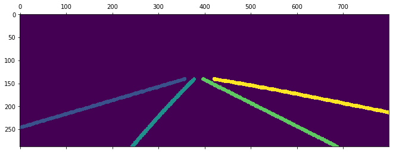

车道线检测-入门（简单的CNN分割模型）

#### 预备知识-数据集介绍

车道线数据集在此以CULane为例（下载地址：[CULane Dataset](https://xingangpan.github.io/projects/CULane.html)），其中文件夹内容分为三类，分别是：

存放图片的多个driver_xxx，存放分割标签的laneseg_label_w16，以及文件列表（实现图片与分割标签对应）list。

```
CULane
┣━driver_23_30frame
┣━driver_37_30frame
┣━driver_100_30frame
┣━driver_161_90frame
┣━driver_182_30frame
┣━driver_193_90frame
┣━laneseg_label_w16
┗━list
```

更具体来说，打开list下的train_gt.txt，其有多行内容，每行内容形如：

```
/driver_23_30frame/05151649_0422.MP4/00000.jpg /laneseg_label_w16/driver_23_30frame/05151649_0422.MP4/00000.png 1 1 1 1
```

不同内容用空格隔开，第一个内容就是图片位置，第二个内容是分割标签的位置，两者是对应的。

在上例中也就是图片/driver_23_30frame/05151649_0422.MP4/00000.jpg，其中的车道线分割结果是/laneseg_label_w16/driver_23_30frame/05151649_0422.MP4/00000.png。

最后四个数字，代表了整个图片中4条车道线（以视频车为中心，左侧相邻车道再左侧的车道，左侧相邻车道，右侧相邻车道，右侧相邻车道再右侧的车道）的有无，本例中表示这四条车道都存在，因此均为1，这个信息在本次模型中没有使用到。

以下为数据读取并展示的示例代码

```python
from PIL import Image
import numpy as np
import matplotlib.pyplot as plt

data_path = r"F:/CULane" #TODO:修改为数据集的实际位置

train_list = data_path + r"/list/train_gt.txt"
#读取训练文件列表
with open(train_list, 'r') as f:
    train_file = f.readlines()

print(len(train_file)) #总数据条数 #=> 88880
print(train_file[0]) #第一条数据内容
#=> /driver_23_30frame/05151649_0422.MP4/00000.jpg /laneseg_label_w16/driver_23_30frame/05151649_0422.MP4/00000.png 1 1 1 1

#将内容按空格划分，取前两个
img_name = train_file[0].split(' ')[0]#图片位置 
print(img_name)  #=> /driver_23_30frame/05151649_0422.MP4/00000.jpg
seg_name = train_file[0].split(' ')[1]#分割标签位置
print(seg_name) #=> /laneseg_label_w16/driver_23_30frame/05151649_0422.MP4/00000.png

#图像
img = Image.open(data_path + img_name)
img = np.array(img)
print(img.shape) #图片尺寸 #=> (590, 1640, 3)
plt.imshow(img)
plt.show()

#分割标签
seg = Image.open(data_path + seg_name)
seg = np.array(seg)
print(seg.shape) #分割标签尺寸 #=> (590, 1640)
plt.matshow(seg)
plt.colorbar()
plt.show()
```

运行上述代码打印图片如下

**图像**

图片尺寸为(590, 1640, 3) ，3代表彩色图片的RGB3通道，每个像素点（横纵坐标位置）数值为0~255。


**分割标签**

分割标签尺寸为(590, 1640)，高宽与图片相同，但只有2维。每个像素点（横纵坐标位置）的值为0~4的整数：0表示该像素处无车道线，1~4代表了此像素点处车道线（以视频车为中心，1~4分别代表：左侧相邻车道再左侧的车道，左侧相邻车道，右侧相邻车道，右侧相邻车道再右侧的车道）的种类。


#### Step1-搭建模型

模型所要实现的功能就是输入图像，输出分割标签作为结果，以实现对图像的车道线检测。

因此模型结构一般是基于卷积的沙漏型（输入输出数据尺寸大，模型中间数据尺寸小），如下图所示：


对于CULane数据，模型的输入是3通道（每个像素点对应RGB三种彩色），输出是5通道（每个像素点对应4种车道和没有车道共5种结果，分几类就是几通道）。

分割模型求车道线实际上是在逐像素的进行分类，给出每个像素点处的车道线的有无和种类。

另外，虽然是沙漏形状，但是从输入到中间数据，和从中间数据到输出不必经过相同数目的层，也就是该模型可以是不对称的结构。

以下为模型结构以及展示的示例代码（model.py)：

```python
# -*- coding: utf-8 -*-
import torch
from torch import nn
import torch.nn.functional as F


'''
注意该模型把图片尺寸（宽高）压缩至原来的1/32后再恢复到原尺寸
如果图片尺寸不是32的整数倍，压缩时有截断，会导致恢复的尺寸与原尺寸不同
'''

#定义模型
class CNN(nn.Module):
    def __init__(self, n_cls = 4):
        #n_cls为车道线类数，每个像素共n_cls+1种可能（n_cls种车道和无车道）
        super().__init__()

        #构造encoder，有多层卷积，每一层卷积使数据尺寸（宽高）减半
        self.encoder1 = nn.Conv2d(3, 16, kernel_size=4, stride=2, padding=1)
        self.encoder2 = nn.Conv2d(16, 32, kernel_size=4, stride=2, padding=1)
        self.encoder3 = nn.Conv2d(32, 64, kernel_size=4, stride=2, padding=1)
        self.encoder4 = nn.Conv2d(64, 128, kernel_size=4, stride=2, padding=1)
        self.encoder5 = nn.Conv2d(128, 256, kernel_size=4, stride=2, padding=1)

        #构造decoder，有多层反卷积，每一层卷积使数据尺寸（宽高）加倍
        self.decoder1 = nn.ConvTranspose2d(256, 128, kernel_size=4, stride=2, padding=1)
        self.decoder2 = nn.ConvTranspose2d(128, n_cls+1, kernel_size=4, stride=2, padding=1)   

    def forward(self,x): 
        #串行通过所有层，每层通过后使用ReLU激活
        #x:(bs,3,h,w)
        x = F.relu(self.encoder1(x)) #->(bs,16,h/2,w/2)
        x = F.relu(self.encoder2(x)) #->(bs,32,h/4,w/4)
        x = F.relu(self.encoder3(x)) #->(bs,64,h/8,w/8)
        x = F.relu(self.encoder4(x)) #->(bs,128,h/16,w/16)
        x = F.relu(self.encoder5(x)) #->(bs,256,h/32,w/32)

        x = F.relu(self.decoder1(x)) #->(bs,128,h/16,w/16)
        x = F.relu(self.decoder2(x)) #->(bs,n_cls+1=5,h/8,w/8)

        #将结果上采样至数据尺寸8倍    
        x = F.interpolate(x, scale_factor=8, mode='bilinear', align_corners=True)
        #->(bs,n_cls+1=5,h,w)

        return x


if __name__ == '__main__':
    model = CNN()
    print(model) #模型结构
    #=> CNN(
    #=>   (encoder1): Conv2d(3, 16, kernel_size=(4, 4), stride=(2, 2), padding=(1, 1))
    #=>   (encoder2): Conv2d(16, 32, kernel_size=(4, 4), stride=(2, 2), padding=(1, 1))
    #=>   (encoder3): Conv2d(32, 64, kernel_size=(4, 4), stride=(2, 2), padding=(1, 1))
    #=>   (encoder4): Conv2d(64, 128, kernel_size=(4, 4), stride=(2, 2), padding=(1, 1))
    #=>   (encoder5): Conv2d(128, 256, kernel_size=(4, 4), stride=(2, 2), padding=(1, 1))
    #=>   (decoder1): ConvTranspose2d(256, 128, kernel_size=(4, 4), stride=(2, 2), padding=(1, 1))
    #=>   (decoder2): ConvTranspose2d(128, 5, kernel_size=(4, 4), stride=(2, 2), padding=(1, 1))
    #=> )

    dummy_img = torch.zeros(1,3,288,800) #创造一个输入数据
    pred = model(dummy_img) 
    print(dummy_img.shape, pred.shape) #模型输入、输出数据的尺寸
    #=> torch.Size([1, 3, 288, 800]) torch.Size([1, 5, 288, 800])
```

该模型把图片尺寸（宽高）压缩至原来的1/32后再恢复到原尺寸，如果图片尺寸不是32的整数倍，压缩时有截断，会导致恢复的。

由此，上述模型可以接受输入尺寸为(288,800)的3通道RGB图像，输出为(288,800)尺寸的5通道车道线分割结果。

该模型的实际结构图为：


该模型即为不对称情况，在由中间数据到输出数据，恢复数据尺寸过程中，只进行了2次反卷积，之后直接使用插值，由于插值方法不需要训练，该方法可以减少模型参数。

输出的分割结果中每个像素点下的5个通道值对应了该位置处5种情况（4类车道和无车道）的概率，（严格来说不是概率，对其处理后才相当于概率，但此时可近似作为概率理解），以其中最大值对应情况作为判断的结果。

#### Step2-创建数据集

训练数据来自CULane数据集，但CULane数据需要经过一系列处理才能供模型使用。

以下为数据集的构造以及展示的示例代码（dataset.py)：

```python
# -*- coding: utf-8 -*-
from PIL import Image
import torch
import numpy as np
from torch.utils.data import Dataset, DataLoader
from torchvision.transforms import Compose,Resize,ToTensor

#模型输入的图片（输出的分割结果）尺寸
h=288 #高
w=800 #宽

#创建图片变换函数：对图片数据进行尺寸变换与tensor张量转换
img_transform = Compose([Resize((288, 800)),#尺寸变换
                         ToTensor(), #转换为张量，同时像素值范围由0~255变为0~1
                         ])

#仿照Resize和ToTensor定义用于分割标签的尺寸变换，张量转换 
#不能和图片用同样的Resize（插值）方法，分割标签尺寸变换时需要用临近值补齐
class segResize(object):
    def __init__(self,size):
        self.size = size
    def __call__(self,seg):
        return seg.resize((self.size[1], self.size[0]), Image.NEAREST)
class segToTensor(object):
    def __call__(self, seg):
        return torch.from_numpy(np.array(seg, dtype=np.int32)).long()#整型
#创建分割标签变换函数：对分割标签数据进行尺寸变换并转为tensor张量
seg_transform = Compose([segResize((288, 800)),#尺寸变换
                         segToTensor(), #转换为张量
                         ])


#定义数据集
class CULaneData(Dataset): 
    def __init__(self, data_path, data_type = 'train'): #train or val
        super().__init__()
        data_list = data_path + r"/list/" + data_type + "_gt.txt"
        #读取文件列表
        with open(data_list, 'r') as f:
            self.data_file = f.readlines()          
        self.data_path = data_path

    def __getitem__(self, index):#从数据库取第index条数据
        #txt文件中取第index行，并拆分，获取原图和分割标签的路径
        file_info = self.data_file[index].split(' ')
        img_name, seg_name = file_info[0], file_info[1] 
        #获取原图和分割标签的绝对路径    
        img_path = self.data_path + img_name
        seg_path = self.data_path + seg_name
        #读取数据
        img = Image.open(img_path)                
        seg = Image.open(seg_path)        
        #对图片和分割标签进行变换，使其尺寸对应模型的输入输出
        img = img_transform(img)
        seg = seg_transform(seg)
        return img, seg

    def __len__(self):#数据库长度
        return len(self.data_file)    
    
    
if __name__ == '__main__':
    
    data_path = r"F:/CULane" #TODO:数据集的实际地址

    #创建训练集和测试集    
    trainset = CULaneData(data_path,'train')
    valset = CULaneData(data_path,'val')
    img,seg = trainset[0]#取训练集的第一组数据
    print(img.shape ,seg.shape) #图片尺寸，分割标签尺寸
    #=> torch.Size([3, 288, 800]) torch.Size([288, 800])
    
    #将数据集组成dataloader，提供数据供模型使用
    trainloader = DataLoader(trainset, batch_size = 16, shuffle = True)
    valloader = DataLoader(valset, batch_size = 16, shuffle = False)
    for img,seg in trainloader:
        print(img.shape, seg.shape) #一批图片和分割标签的数据
        #=> torch.Size([16, 3, 288, 800]) torch.Size([16, 288, 800])
        break
```

需要定义Transform方法对CULane数据集的图片、分割标签的宽高尺寸进行变换以适应模型的输入、输出。

由上一步中的模型输入输出尺寸限制，所以供其训练的数据集图片尺寸定为高宽(288,800)。

需要注意的是，分割标签按前述，数值为0~5，对其进行的尺寸变换需要自写方法，不能使用torch自带的Resize方法。因为Resize变换尺寸利用插值进行，这将导致分割标签有无车道的边缘处因为插值而产生错误标签。

使用自写方法改变尺寸（按距离最近的像素点数值，就近填充）



使用Resize方法改变尺寸（利用周围像素点值，插值填充）


Resize方法因为是插值，在某些车道线边缘，例如无车道0与车道4的交界处，其像素值按插值计算变成了其他车道线的数值。而采用就近填充，交界处的像素值只能是0或4.

#### Step3-评价模型效果

注意，**CULane数据集有官方的效果指标代码**，[GitHub - XingangPan/SCNN: Spatial CNN for traffic lane detection (AAAI2018)](https://github.com/XingangPan/SCNN)[GitHub - XingangPan/SCNN: Spatial CNN for traffic lane detection (AAAI2018)](https://github.com/XingangPan/SCNN) 。**写论文做测试请务必使用官方方法测评效果**。

本例中的评价代码是借用CULane官方代码的思路，但形式上结果上完全不同，仅供个人据此粗略判断模型效果。所有使用CULane数据集的算法评价应使用官方方法才有可比性，切勿将本节非官方方式求出的指标用于论文中。

首先明确TP,FN,TN,FP的概念。
TP：True Positive，模型判断结果为正样本，真实结果也为正样本，正确判断的情况。
FN：False Negative，模型判断结果为负样本，但真实结果为正样本，漏报情况。
TN：True Negative，模型判断结果为负样本，真实结果也为负样本，正确判断的情况。
FP：False Positive，模型判断结果为正样本，但真实结果为负样本，误报情况。

| 真实结果\模型判断 | 正                 | 负                 |
| --------- | ----------------- | ----------------- |
| 正         | TP：True Positive  | FN：False Negative |
| 负         | FP：False Positive | TN：True Negative  |

方法为对某条车道线，将标签结果和模型判断结果按图中位置进行比对，求取两者交集部分和并集部分的像素点个数比（即交并比IOU，也就是两者的重合程度），同时设置一个阈值，如果IOU超过阈值就认为判断正确（即TP），否则则判断错误（即FN）。


上面是标签结果（真实结果）存在车道线的情况，也有部分图像中缺失4条车道线中的一条或多条，此时，如果模型判断结果中该车道也没有像素点，就认为判断正确（即TN），一旦模型判断结果中存在该车道，则为判断错误（FP）。


以下为对模型结果进行评价的示例代码（utils.py)：

```python
# -*- coding: utf-8 -*-
import numpy as np
import torch

#从每批的分割标签和模型结果求取TP,FN,TN,FP样本统计个数
def get_metric(pred, seg, n_cls=4, iou_thresh = 0.5):
    #pred 模型判断结果, seg 分割标签 形状均为(bs,h,w) numpyArray
    #其中每个像素值为0~n_cls的整数，表明该点所属n_cls+1种情况中的哪一种
    #0类是无车道背景，1~n_cls是不同种车道线
    #返回该批次模型判断的tp fp tn fn

    tp,fn,tn,fp = 0,0,0,0
    for i in range(n_cls+1):
        if i == 0: #无车道线不计算
            continue
        else:  #只计算车道线            
            a = (pred==i) #模型判断pred中各个像素为第i条车道线的bool值
            b = (seg==i) #分割标签seg中各个像素为第i条车道线的bool值            
            union = a+b #bool值的和为并集 #一个为True，和为True
            inter = a*b #bool值的积为交集 #均为Ture，积为Ture

            n_a = np.sum(a,axis=(1,2)) #预测车道线像素数（为0表示不存在车道线）
            n_b = np.sum(b,axis=(1,2)) #标签车道线像素数（为0表示不存在车道线）
            n_u = np.sum(union,axis=(1,2)) #预测和标签并集像素数
            n_i = np.sum(inter,axis=(1,2)) #预测和标签交集像素数

            segT = (n_b!= 0) #分割标签中存在第i条车道线的正样本index
            iou = n_i[segT] / n_u[segT] #对存在车道线的样本计算预测和标签的交并比

            tp += np.sum(iou>=iou_thresh) #超过阈值，模型判断为正例（车道线）且正确判断
            fn += np.sum(iou<iou_thresh) #不超过阈值，模型判断为非车道线但判断错误，漏检
            # assert TP+FN == sum(segT)

            segF = ~segT #分割标签中不存在第i条车道线的负样本index   
            tn += sum(n_a[segF] == 0) #预测结果内也无车道线，模型判断为负例且正确判断
            fp += sum(n_a[segF] != 0) #模型判断为正例（右车道线）但判断错误，误检
            # assert TN+FP == sum(segF)

    # assert TP+FN+TN+FP == pred.shape[0]*(n_cls-1)
    return tp,fn,tn,fp

#从TP,FN,TN,FP样本统计个数求取各种统计指标
def get_score(tp,fn,tn,fp):
    eps=1e-8 #指标中分母加一个极小值避免分母为0
    acc = (tp+tn)/(tp+fn+tn+fp) #准确率，所有正负样本中正确判断的比例
    per = tp/(tp+fp+eps) #查准率（精确率），所有模型正例判断中，确实是正样本的比例
    rec = tp/(tp+fn+eps) #查全率（召回率），所有样本正例中，模型判断出正例的比例
    f1 = (2*per*rec)/(per+rec+eps) #f1score 综合查准和查全
    return acc,per,rec,f1


if __name__ == '__main__':
    #构造两个数据来测试
    pred = torch.zeros(3,4)
    pred[0,2]=pred[1,1]=pred[2,0]=1
    seg = torch.zeros(3,4)
    seg[:,1] = 1

    pred = pred[None,:].numpy() #(1,3,4)
    seg = seg[None,:].numpy() #(1,3,4)

    print(pred)
    #=> [[[0. 0. 1. 0.]
    #=>   [0. 1. 0. 0.]
    #=>   [1. 0. 0. 0.]]]
    print(seg)
    #=> [[[0. 1. 0. 0.]
    #=>   [0. 1. 0. 0.]
    #=>   [0. 1. 0. 0.]]]

    print(get_metric(pred, seg, 1, 0.5))
    #=> (0, 1, 0, 0) #只有一条车道，iou阈值0.5时，认为预测车道和实际车道不符，FP
    print(get_metric(pred, seg, 1, 0.1))
    #=> (1, 0, 0, 0) #只有一条车道，iou阈值0.1时，认为预测车道和实际车道相符，TP
    print(get_metric(pred, seg, 2, 0.1))
    #=> (1, 0, 1, 0)
    #有两条车道，iou阈值0.1时，认为序号为1对应的车道预测和实际相符，TP
    #同时序号为2的车道预测和实际都不存在，TN
```

再次重复，上述评价方式并不规范，一般方法为fn=车道标签数-tp，fp=车道预测数-tp，这意味着如果模型预测了车道但与标签车道iou值较小，这一个车道样本既会被判断为fn（标签车道没检测出来，漏检），又会被判断为fp（预测处没有车道，误检）。

而本评价方法认为标签有车道的情况下，只要预测的车道iou重合度低，仅作为fn。或者说fp只代表标签中无车道而预测出车道的情况，不包含标签中有车道但iou低于阈值的情况。这样一个车道线样本只会被计数一次，可计算准确率。

#### Step4-主流程 模型训练与调用

该步骤需要依赖前3步中的模型、数据集、评估的方法。

需将前3步代码存为对应py文件，再通过import导入。（或者手动运行前3步代码，这相当于实现了import导入，不再需要import三个py文件）

根据需求运行下列代码main.py

```python
# -*- coding: utf-8 -*-
'定义模型'
#导入模型，数据集，评估方法（确保文件夹下有对应的py文件）
from dataset import CULaneData, img_transform
from model import CNN
from utils import get_metric, get_score
#导入库
from PIL import Image
import torch
from torch import optim
from torch.nn import CrossEntropyLoss
import numpy as np
import matplotlib.pyplot as plt  
from tqdm import tqdm
from torch.utils.data import DataLoader
print('[Import Complete]')
#创建模型
model = CNN() 
model_path= r"Simple-CNN.pt" #TODO：请修改为进行模型存储的实际地址

try: #如果本地已有同名模型，则载入模型继续训练
    model.load_state_dict(torch.load(model_path))
    print('[Train from Checkpoint]')
except: #否则从头训练
    print('[Train from Startpoint]')    
#设置训练设备，并把模型加载到设备
device = torch.device('cuda' if torch.cuda.is_available() else 'cpu')
model = model.to(device)


'训练模型'
data_path = r"F:/CULane" #TODO：请修改为数据集的实际地址
#超参数
epoch = 15 #训练轮数
learning_rate = 1e-3 #学习率
batch_size = 16 #批尺寸 

#创建训练集和测试集    
trainset = CULaneData(data_path,'train')
valset = CULaneData(data_path,'val')
#根据数据集设置dataloader（分别为训练，验证用）
trainloader = DataLoader(trainset, batch_size = batch_size, shuffle = True)
valloader = DataLoader(valset, batch_size = batch_size, shuffle = False)

#优化器
optimizer = optim.Adam(lr = learning_rate, params = model.parameters())
#损失函数（针对于每个像素点的多分类问题）
loss_f = CrossEntropyLoss(reduction = 'mean')

#训练及验证
for i in range(epoch):#每轮
    #训练
    model.train() 
    loss_train = 0 #训练总损失
    metric_train = np.array([0,0,0,0]) #训练总统计 #分别为TP,FN,TN,FP
    trainbar =  tqdm(trainloader,desc = f"[Train Epoch {i}]") #设置进度条
    for j,(img,seg) in enumerate(trainbar):#取训练数据
        img = img.to(device) #(bs,3,h,w)
        seg = seg.to(device) #(bs,5,h,w)

        #调用模型输出分割结果
        pred = model(img)  #(bs,5,h,w)
        loss = loss_f(pred,seg) #计算模型结果与标签（正确结果）的偏差，该批次的损失
        loss_train += loss.item() #累加计入训练总损失

        loss.backward() #梯度反向传播
        optimizer.step() #更新模型参数 
        optimizer.zero_grad() #清空梯度

        pred = pred.detach().cpu().numpy()  
        seg = seg.cpu().numpy()
        #每个像素点处有5个值，其中最大值对应的通道序号是该点的车道线类别（四种车道和无车道）
        pred = np.argmax(pred,axis=1) #(bs,h,w)
        metric = get_metric(pred, seg, iou_thresh = 0.5) #该批次的统计
        metric_train += np.array(metric) #累加计入总统计

        trainbar.set_postfix({'loss':loss.item()}) #进度条显示该批的实时损失

        ###########展示（如不需要可删除该部分）
        if j%1000 == 0: #每训练1000批，进行一次图片展示
            img, seg = trainset[1] #从验证集取一条数据
            #调用模型
            pred = model(img[None,:].to(device))[0] #(5,h,w)
            pred = pred.detach().cpu().numpy()  
            pred = np.argmax(pred,axis=0) #(5,h,w)->(h,w)
            #显示图片
            img = img.permute(1,2,0).cpu().numpy()
            img = (img*255).astype('uint8')
            plt.imshow(img)
            plt.show()
            #显示真实分割结果
            seg = seg.cpu().numpy()
            plt.matshow(seg)
            plt.show()
            #显示模型输出的分割结果
            fig, ax = plt.subplots()
            ax.text(0.9, 0.9, f'epoch{i}-batch{j}', ha = 'right', va = 'top', transform=ax.transAxes, color = 'w', size = 20)
            ax.matshow(pred)
            # plt.savefig(f'{i}-{j}.png') #存储图片
            plt.show()      
        ##############

    tLoss = loss_train/len(trainloader.dataset) #每轮结束打印该轮总损失
    tAcc,tPer,tRec,tF1 = get_score(*metric_train) #每轮结束打印该轮总指标
    print("[Train SUMMARY]",
          "Loss:%.5f,"%(tLoss),
          "Accuracy:%.2f%%,"%(tAcc*100),
          "Percision:%.2f%%,"%(tPer*100),
          "Recall:%.2f%%,"%(tRec*100),
          "F1Score:%.2f%%"%(tF1*100)) 

    #验证
    model.eval()
    loss_val = 0 #验证总损失
    metric_val = np.array([0,0,0,0]) #验证总统计结果 #分别为TP,FN,TN,FP
    valbar =  tqdm(valloader,desc = f"[Eval Epoch {i}]") #设置进度条
    for j,(img,seg) in enumerate(valbar):#取验证数据
        img = img.to(device) #(bs,3,h,w)
        seg = seg.to(device) #(bs,5,h,w)

        #调用模型输出分割结果
        pred = model(img) #(bs,5,h,w)
        loss = loss_f(pred,seg) #计算模型结果与标签（正确结果）的偏差
        loss_val += loss.item() #累加验证总损失

        pred = pred.detach().cpu().numpy()  
        seg = seg.cpu().numpy()
        #每个像素点处有5个值，其中最大值对应的通道序号是该点的车道线类别（四种车道和无车道）
        pred = np.argmax(pred,axis=1) #(bs,h,w)
        metric = get_metric(pred, seg, iou_thresh = 0.5) #该批次的统计结果
        metric_val += np.array(metric) #累加计入总统计结果

        valbar.set_postfix({'loss':loss.item()}) #进度条显示该批的实时损失

    tLoss = loss_val/len(trainloader.dataset) #每轮结束打印该轮总损失
    tAcc,tPer,tRec,tF1 = get_score(*metric_val) #每轮结束打印该轮总指标
    print("[Eval SUMMARY]",
          "Loss:%.5f,"%(tLoss),
          "Accuracy:%.2f%%,"%(tAcc*100),
          "Percision:%.2f%%,"%(tPer*100),
          "Recall:%.2f%%,"%(tRec*100),
          "F1Score:%.2f%%\n"%(tF1*100))  

    #保存模型到本地
    torch.save(model.state_dict(), model_path) 


'调用模型' 
#读取一张图片 
image_path = "sample.jpg" #TODO:使用时修改为要进行车道检测的实际图片地址
img = Image.open(image_path) 
#将其用训练时同样的图片变换函数进行处理，以使其变为张量，范围变为0~1，并符合模型输入尺寸
img = img_transform(img).to(device)

#使用模型
pred = model(img[None,:])[0] #(3,h,w)->(1,3,h,w)=model=>(1,5,h,w)->(5,h,w)

#每个像素点处有5个值，其中最大值对应的通道序号是该点的车道线类别（四种车道和无车道）
pred = pred.detach().cpu().numpy()  
pred = np.argmax(pred,axis=0) #(5,h,w)->(h,w)


#将模型输入的图片，范围由0~1还原到0~255，rgb通道由第0轴换到第2轴
img = (255*(img.cpu().numpy().transpose(1,2,0))).astype('uint8')
color = [(255,0,0),(0,255,0),(0,0,255),(255,255,0)] #对四种车道线分别上红绿蓝黄四色
for i,c in zip(range(1,5),color):#依次在原图上绘制车道线
    img[pred==i,:] = c#分割结果中为车道线的像素点，在原图上进行重新绘制为指定颜色

plt.imshow(img)
plt.show()
```

代码分为**模型定义**，**模型训练**，**模型调用**三部分。

**模型定义**包含相关库、方法的导入和模型定义，其中所用的模型、数据集、评估方法已在前3步介绍。

- 如果只是进行模型训练，并存储本地，需要运行**模型定义**、**模型训练**部分。
  
  - 训练时注意修改data_path，model_path到实际的数据地址、进行模型存储的地址。
  - 如果model_path已经有本地模型，将在此基础上继续训练。

- 如果已经训练完成，已有本地模型，只是使用模型，需要进行**模型定义**、**模型调用**部分。
  
  - 使用时注意修改model_path，image_path到实际的进行模型读取的地址、进行车道检测图片的地址。

##### Step4.1 训练

pytorch中交叉熵损失函数CrossEntropyLoss的特点是不必对标签做onehot encoding（独热编码），或者说损失函数中已经包含了一系列的处理方法，不需要额外进行。因此计算损失时，(288,800)格式的分割标签和(5,288,800)的模型分割结果直接使用。

当然如果使用如均方误差损失MSELoss的话，需要(288,800)格式的分割标签进行onehot coding，将变成与模型分割结果同为(5,288,800)的5通道数据。

可以认为，与模型分割结果类似，分割标签的每个通道值也代表该类别的概率。由于是标签，是确定的结果，所以所属类别的通道值为1（100%），其他通道值为0。

某条测试集的分割标签（正确结果）


训练中展示的模型判断结果（随训练过程不断接近正确结果）


训练过程中的进度条与评估结果如下所示：

```
[Train Epoch 14]: 100%|██████████| 5555/5555 [24:40<00:00,  3.75it/s, loss=0.0396, accucary=67.19%, percision=89.29%, recall=58.14%, f1-score=70.42%] 
[Train SUMMARY] Loss:0.00213, Accuracy:74.73%, Percision:92.80%, Recall:71.84%, F1Score:80.98%
[Eval Epoch 14]: 100%|██████████| 605/605 [02:29<00:00,  4.04it/s, loss=0.0672, accucary=59.09%, percision=100.00%, recall=59.09%, f1-score=74.29%]
[Eval SUMMARY] Loss:0.00058, Accuracy:46.76%, Percision:86.35%, Recall:43.90%, F1Score:58.21%
```

**再次重复，CULane数据集有官方的效果指标代码，而下列代码中的评价代码是自写的，非官方的，写论文做测试请务必使用官方方法测评效果。**

##### Step4.2 调用

如果不需训练，在本地存在模型，则模型定义完成后可直接读取一张图片使用模型进行判断，该图片要经过和数据集一样的尺寸变换，本文中为(3,288,800)，才能输入模型。

模型的输出(5,288,800)，需要通过前述的方法，选择5个通道中值最高对应的情况作为该像素点处的车道判断结果，并根据车道线情况上色（无车道线不上色，四种车道线为红绿蓝黄）。

