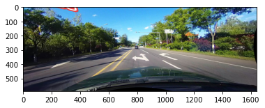
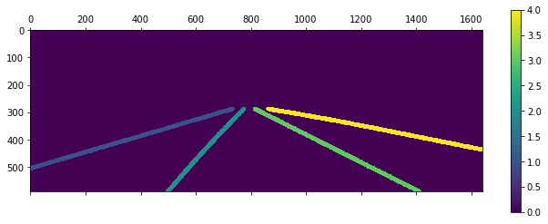
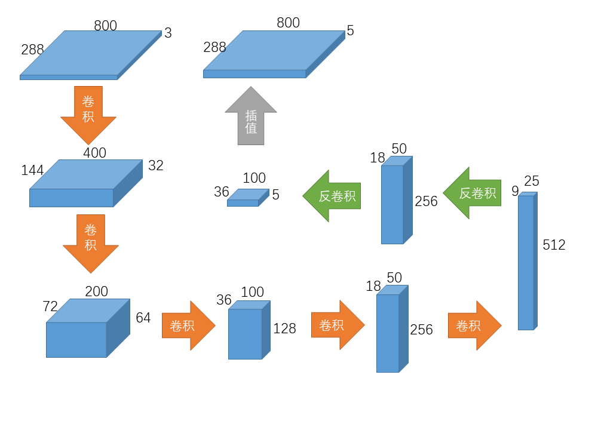
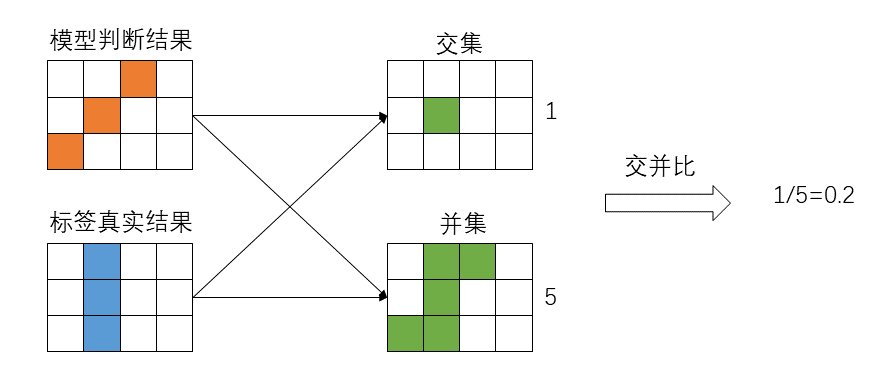
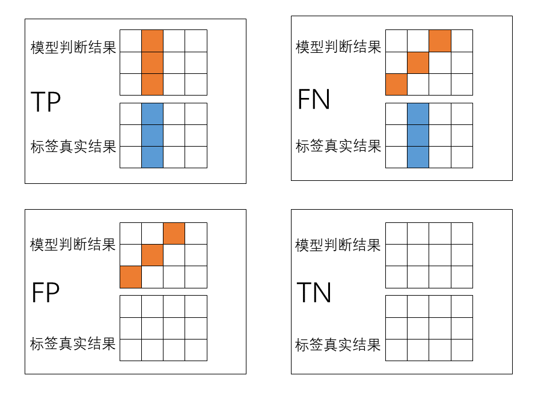
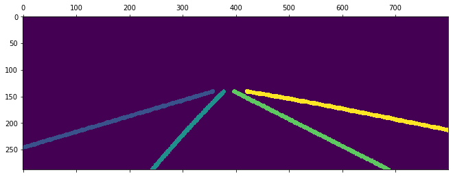
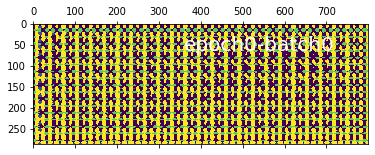
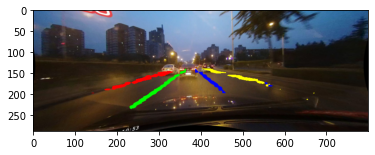

### 车道线检测-入门（简单的CNN分割模型）

#### 预备知识-数据集介绍

车道线数据集在此以CULane为例（下载地址：[CULane Dataset](https://xingangpan.github.io/projects/CULane.html)），其中文件夹内容分为三类，分别是：

存放图片的多个driver_xxx，存放分割标签的laneseg_label_w16，以及文件列表（实现图片与分割标签对应）list。

```
CULane
┣━driver_23_30frame
┣━driver_37_30frame
┣━driver_100_30frame
┣━driver_161_90frame
┣━driver_182_30frame
┣━driver_193_90frame
┣━laneseg_label_w16
┗━list
```

更具体来说，打开list下的train_gt.txt，其有多行内容，每行内容形如：

```
/driver_23_30frame/05151649_0422.MP4/00000.jpg /laneseg_label_w16/driver_23_30frame/05151649_0422.MP4/00000.png 1 1 1 1
```

不同内容用空格隔开，第一个内容就是图片位置，第二个内容是分割标签的位置，两者是对应的。

在上例中也就是图片/driver_23_30frame/05151649_0422.MP4/00000.jpg，其中的车道线分割结果是/laneseg_label_w16/driver_23_30frame/05151649_0422.MP4/00000.png。

最后四个数字，代表了整个图片中4条车道线（以视频车为中心，左侧相邻车道再左侧的车道，左侧相邻车道，右侧相邻车道，右侧相邻车道再右侧的车道）的有无，本例中表示这四条车道都存在，因此均为1，这个信息在本次模型中没有使用到。

以下为数据读取并展示的示例代码

```python
from PIL import Image
import numpy as np
import matplotlib.pyplot as plt

data_path = r"F:/CULane" #TODO:修改为数据集的实际位置

train_list = data_path + r"/list/train_gt.txt"
#读取训练文件列表
with open(train_list, 'r') as f:
    train_file = f.readlines()

print(len(train_file)) #总数据条数 #=> 88880
print(train_file[0]) #第一条数据内容
#=> /driver_23_30frame/05151649_0422.MP4/00000.jpg /laneseg_label_w16/driver_23_30frame/05151649_0422.MP4/00000.png 1 1 1 1

#将内容按空格划分，取前两个
img_name = train_file[0].split(' ')[0]#图片位置 
print(img_name)  #=> /driver_23_30frame/05151649_0422.MP4/00000.jpg
seg_name = train_file[0].split(' ')[1]#分割标签位置
print(seg_name) #=> /laneseg_label_w16/driver_23_30frame/05151649_0422.MP4/00000.png

#图像
img = Image.open(data_path + img_name)
img = np.array(img)
print(img.shape) #图片尺寸 #=> (590, 1640, 3)
plt.imshow(img)
plt.show()

#分割标签
seg = Image.open(data_path + seg_name)
seg = np.array(seg)
print(seg.shape) #分割标签尺寸 #=> (590, 1640)
plt.matshow(seg)
plt.colorbar()
plt.show()
```

运行上述代码打印数据图片如下

**图像**

图片尺寸为(590, 1640, 3) ，3代表彩色图片的RGB3通道，每个像素点（横纵坐标位置）数值为0~255。



**分割标签**

分割标签尺寸为(590, 1640)，高宽与图片相同，但只有2维。每个像素点（横纵坐标位置）的值为0~4的整数：0表示该像素处无车道线，1~4代表了此像素点处车道线的种类（以视频车为中心，1~4分别代表：左侧相邻车道再左侧的车道，左侧相邻车道，右侧相邻车道，右侧相邻车道再右侧的车道）。



#### Step1-搭建模型

代码： [model.py](model.py) 

模型所要实现的功能就是输入图像，输出分割作为结果，以实现对图像的车道线检测。

对于CULane数据，模型的输入是某尺寸的3通道RGB图片（每个像素点对应RGB三种彩色），输出是同尺寸的5通道结果（分几类就是几通道，本例中是4种车道线以及无车道背景共五类）。

分割模型求车道线实际上是在逐像素的进行分类。

因此模型结构一般是基于卷积的沙漏型（输入输出数据尺寸大，模型中间数据尺寸小），如下图所示：


代码中模型的实际结构图为：



该模型把图片尺寸（宽高）压缩至原来的1/32后再恢复到原尺寸，如果图片尺寸不是32的整数倍，压缩时有截断，会导致恢复的尺寸与输入图片原尺寸不符。

该模型恢复数据尺寸过程中，只进行了2次反卷积，之后直接使用插值，由于插值方法不需要训练，该方法可以减少模型参数。

输出的分割结果中每个像素点下的5个通道值对应了该位置处5种情况（4类车道和无车道）的概率，（严格来说输出不是概率，对其处理后才相当于概率，但此时可近似作为概率理解），以其中值最大的情况作为判断的结果。

#### Step2-创建数据集

代码： [dataset.py](dataset.py) 

训练数据来自CULane数据集，但CULane数据需要经过一系列处理才能供模型使用。

需要定义Transform方法对CULane数据集的图片、分割标签的宽高尺寸进行变换以适应模型的输入、输出。

由上一步中的模型输入输出有尺寸限制，所以供其训练的数据集图片尺寸可定为高宽(288,800)。

需要注意的是，分割标签按前述数值为0~5，对其进行的尺寸变换需要自写方法，不能使用torch自带的Resize方法。因为Resize变换尺寸利用插值进行，这将导致分割标签有无车道的边缘处因为插值而产生错误标签。

下面是一个不同方法改变分割标签的例子，改变尺寸到（18,50）

使用自写方法（按距离最近的像素点数值，就近填充）


使用现成的Resize方法（利用周围像素点值，插值填充）


Resize方法因为是插值，在某些车道线边缘，例如无车道0与车道4的交界处，其像素值按插值计算变成了其他车道线的数值。而采用就近填充，交界处的像素值只能是0或4.

#### Step3-评价模型效果

代码： [utils.py](utils.py) 

注意，**CULane数据集有官方的效果指标代码**，[GitHub - XingangPan/SCNN: Spatial CNN for traffic lane detection (AAAI2018)](https://github.com/XingangPan/SCNN)[GitHub - XingangPan/SCNN: Spatial CNN for traffic lane detection (AAAI2018)](https://github.com/XingangPan/SCNN) 。**本例中的评价代码是借用CULane官方代码的思路，但形式上结果上完全不同，仅供个人据此粗略判断模型效果，写论文做测试请务必使用官方方法测评效果**。

首先明确TP,FN,TN,FP的概念。
TP：True Positive，模型判断结果为正样本，真实结果也为正样本，正确判断的情况。
FN：False Negative，模型判断结果为负样本，但真实结果为正样本，漏报情况。
TN：True Negative，模型判断结果为负样本，真实结果也为负样本，正确判断的情况。
FP：False Positive，模型判断结果为正样本，但真实结果为负样本，误报情况。

| 真实结果\模型判断 | 正                 | 负                 |
| --------- | ----------------- | ----------------- |
| 正         | TP：True Positive  | FN：False Negative |
| 负         | FP：False Positive | TN：True Negative  |

评价函数有两种模式，acc和默认，默认是参考CULane官方方法写出的。

对某条车道线，将标签结果和模型判断结果按图中位置进行比对，求取两者交集部分和并集部分的像素点个数比（即交并比IOU，也就是两者的重合程度）。



对于所有分割标签存在车道线的情况，计算出标签车道与模型判断车道的IOU后，将IOU与一个预设的阈值比较，如果超过阈值就记为TP（存在车道且判断有，判断正确），如果低于记为FN（存在车道但判断没有，判断错误，漏检）。

对于所有模型判断出车道线的情况，计算出判断车道与标签车道的IOU，如果IOU低于之前预设的阈值，记为FP（不存在车道但判断有，判断错误，误检）。（如果超过就是之前TP情况）。

标签车道与预测车道的IOU如果达不到阈值，会被计数两次（FP预测处没有车道以及FN实际车道处没有预测），而且对没有车道又没有预测的情况（TN）不进行计数。



#### Step4-主流程 模型训练与调用

代码： [main.py](main.py) 

代码分为**模型定义**，**模型训练**，**模型调用**三部分。

**模型定义**包含相关库、方法的导入和模型定义，其中所用的模型、数据集、评估方法已在前3步介绍。

- 如果只是进行模型训练，并存储本地，需要运行**模型定义**、**模型训练**部分。
  
  - 训练时注意修改data_path，model_path到实际的数据地址、进行模型存储的地址。
  - 如果model_path已经有本地模型，将在此基础上继续训练。

- 如果已经训练完成，已有本地模型，只是使用模型，需要进行**模型定义**、**模型调用**部分。
  
  - 使用时注意修改model_path，image_path到实际的进行模型读取的地址、进行车道检测图片的地址。

##### Step4.1 训练

pytorch中交叉熵损失函数CrossEntropyLoss中已经包含了一系列的处理方法，不必对标签做onehot encoding（独热编码），也不必对模型的输出结果进行logsoftmax（也就是前文中的把输出的值转变为概率）。因此计算损失时，(288,800)格式的分割标签和(5,288,800)的模型分割结果直接使用。

某条测试集的分割标签（正确结果）



训练中展示的模型判断结果（随训练过程不断接近正确结果）



训练过程中的进度条与评估结果如下所示：

```
[Train Epoch 14]: 100%|██████████| 5555/5555 [24:40<00:00,  3.75it/s, loss=0.0396, accucary=67.19%, percision=89.29%, recall=58.14%, f1-score=70.42%] 
[Train SUMMARY] Loss:0.00213, Accuracy:74.73%, Percision:92.80%, Recall:71.84%, F1Score:80.98%
[Eval Epoch 14]: 100%|██████████| 605/605 [02:29<00:00,  4.04it/s, loss=0.0672, accucary=59.09%, percision=100.00%, recall=59.09%, f1-score=74.29%]
[Eval SUMMARY] Loss:0.00058, Accuracy:46.76%, Percision:86.35%, Recall:43.90%, F1Score:58.21%
```

##### Step4.2 调用

如果不需训练，在本地存在模型，则模型定义完成后可直接读取一张图片使用模型进行判断，该图片要经过和数据集一样的尺寸变换，本文中为(3,288,800)，才能输入模型。

模型的输出(5,288,800)，需要通过前述的方法，选择5个通道中值最高对应的情况作为该像素点处的车道判断结果，并根据车道线情况上色（无车道线不上色，四种车道线为红绿蓝黄）。



**再次重复，CULane数据集有官方的效果指标代码，而代码中的评价代码是自写的，非官方的，写论文做测试请务必使用官方方法测评效果。**
